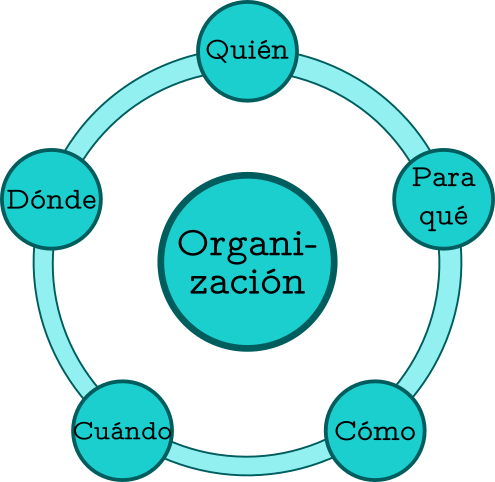
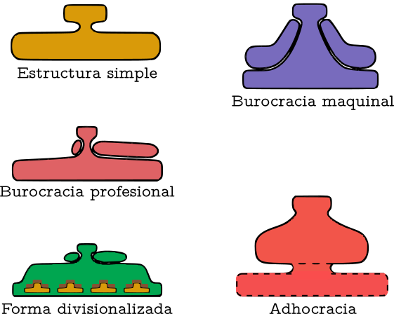
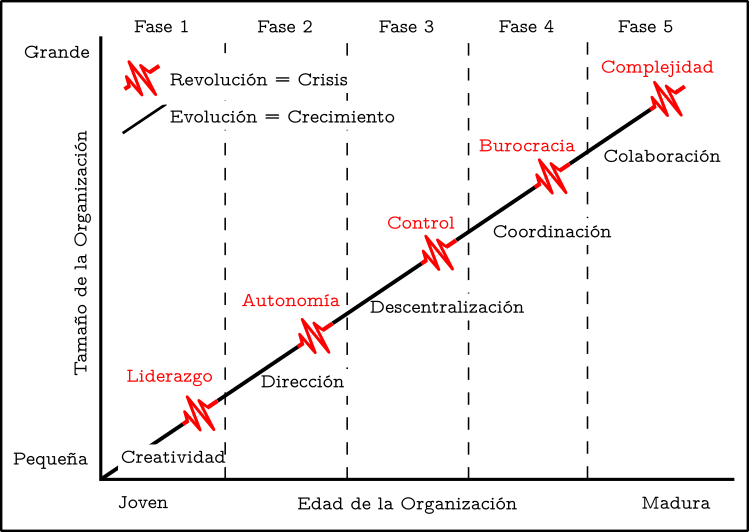

---
title:  'Psicologia de les Organitzacions'
author:
- name: Juan Muñoz
  affiliation: Universitat Autònoma de Barcelona
tags: [Conductas colectivas]
tema: "ST1"
url: "http:/juan.psicologiasocial.eu"
bibliography: diapos.bib
csl: apa.csl
lateral-menu: 'True'
...

## Las organizaciones existen para

::: nonincremental
- Aunar los recursos para lograr los objetivos y resultados deseados
- Producir bienes y servicios de manera eficiente
- Facilitar la innovación
- Utilizar las tecnologías modernas de fabricación e información
- Adaptarse e influir en un entorno cambiante
- Crear valor para los propietarios, clientes y empleados
- Dar cabida a los desafíos actuales de la diversidad, la ética, y la motivación y la coordinación de los empleados
:::

@daft-Organizationtheory-2010[, p. 14]

## Descripción

::: notes
- Quién: Personas y grupos que realizan actividades. Se articulan a través de normas y valores.
- Para qué: Orientación a objetivos y metas.
- Cómo: Diferenciación de funciones. Coordinación relacionada intencionada.
- Cuándo: Duraderas en el tiempo.
- Dónde: Inmersas en un medio social.
:::

## Estructura

>La estructura organizativa se refiere a la manera formal e informal en que las personas, las tareas y otros recursos de la organización están [configurados]{.fosforito} y [coordinados]{.fosforito}.\
@kottke-OrganizationalStructure-2007[p, 585]]

## Estructura

![Adaptado de @mintzberg-Structurefives-1993[11]](imagenes-organizaciones/Estructura.png)

::: notes
- Núcleo de operaciones: realiza la actividad principal de la organización.
- Ápice estratégico: primera división del trabajo. Gobiernan la organización.
Línea media: aumento de complejidad de la organización. Mandos intermedios.
Tecnoestructura: estandarizar procesos de trabajo. Técnicos expertos en la actividad principal de la organización.
Personal de apoyo: no directamente vinculados con la actividad principal.
Ideología: fuerza motora para la cooperación en la organización.
:::

## Tipos de organizaciones

## Configuraciones organizacionales {#configuraciones .peque}

|                      | CONFIGURACIÓN                     | MECANISMO DE COORDINACIÓN               | PARTE CLAVE DE LA ORGANIZACIÓN | TIPO DE DESCENTRALIZACIÓN              |
|-------------------------|-----------------------------------|-----------------------------------------|--------------------------------|----------------------------------------|
| **Estructura simple**       | Organización empresarial          | Supervisión directa                     | Ápice estratégico              | Centralización horizontal y vertical  |
| **Burocracia maquinal**     | Organización máquina -industrial- | Estandarización de procesos de trabajo | Tecnoestructura                | Descentralización horizontal limitada |
| **Burocracia profesional** | Organización profesional          | Estandarización de habilidades           | Núcleo de operaciones          | Descentralización                      |
| **Forma divisionalizada**  | Organización diversificada        | Estandarización de producción           | Linea intermedia                | Descentralización vertical limitada    |
| **Adhocracia**              | Organización innovadora           | Adaptación mutua                        | Personal de apoyo              | Descentralización selectiva            |
| **Misionera**               | Organización misionera            | Estandarización de normas               | Ideología                      | Descentralización                     |
|                         | Organización política             | Ninguna                                 | Ninguna                        | Varia                                  |

# La curva de Greiner

{width=600}

::: notes
Fase 1: etapa de emprendimiento
Fase 2: Etapa de colectividad
Fase 4: Etapa de formalización
Fase 5: Etapa de elaboración

Daft las explica como 1, 2, 3 y 4
@daft-Organizationtheory-2010

:::

# Referencias {.center}

## {.scrollable .peque}
