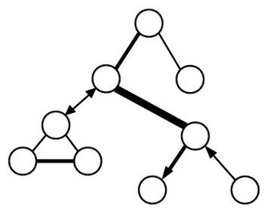
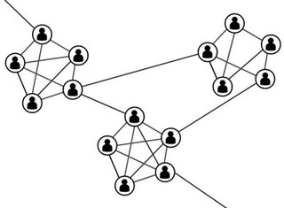

---
title:  'Influencia Social y Grupos'
author:
- name: Juan Muñoz
  affiliation: Universitat Autònoma de Barcelona
tags: [Comunicación, Redes sociales]
tema: "Redes de comunicación"
url: "http:/juan.psicologiasocial.eu"
bibliography: diapos.bib
csl: apa.csl
lateral-menu: 'True'
...

## Dilema del prisionero
>Dada la enorme recompensa ofrecida y el pleno perdón que se concede por toda declaración probatoria, no cabe imaginar un solo instante que algún miembro de una pandilla de miserables criminales —o de cualquier pandilla— no haya traicionado hace rato a sus cómplices. En una pandilla colocada en esa situación, cada uno de sus miembros no está tan ansioso de recompensa o de impunidad, como temeroso de ser traicionado. Se apresura a delatar lo antes posible, a fin de no ser delatado a su turno. \
`Edgard Allan Poe, El misterio de Marie Rogêt`{.autor}

##

## Comunicación

>La comunicación es la base de toda interacción humana y del funcionamiento del grupo. Nuestra vida cotidiana está llena de una experiencia de comunicación tras otra. Es a través de la comunicación que interactúan los miembros del grupo, y una comunicación eficaz es un requisito previo para todos los aspectos de funcionamiento del grupo.\
@johnson_joining_2014 [116]

<!--
##Ejercicio {.references}

. . .

Bavelas, A. (1950-1951). Patrones de comunicación en grupos orientados a la tarea. En A.D.Cartwright. y A.Zander (Eds.). (1968). *Dinámica de grupos. Investigación y teoría*  (Pp. 548-557). México: Trillas.

Leavitt, H.J. (1951). Some effects of certain communication patterns on group performance. *Journal of Abnormal and Social Psychology*, 46: 38-50.

-->

## Comunicación: Redes
>¿Podría ocurrir que entre varios patrones de comunicación —todos lógicamente adecuados a completar con éxito una tarea especificada— uno permitiera mejor ejecución que otro? ¿Qué efectos tendrá el patrón, como tal, sobre el surgimiento del liderazgo, el desarrollo de la organización y el grado de resistencia a la ruptura del grupo?\
@bavelas_communication_1950 [726]

## Eficacia

## liderazgo

## Satisfacción con la tarea

## Efecto del tipo de tarea

|                  | Tareas simples  | Tareas complejas |
|:-----------------|:----------------|:-----------------|
| Menos mensajes   | Centralizada    | Centralizada     |
| Menos tiempo     | Centralizada    | Descentralizada  |
| Menos errores    | Centralizada    | Descentralizada  |
| Más satisfacción | Descentralizada | Descentralizada  |

## Conceptos explicativos: Saturación

>Cuando un grupo trabaja en un problema intercambiando información y tomando decisiones, la posición central en la red es quien mejor puede gestionar los inputs e interacciones del grupo. A medida que avanza la tarea y se incrementa el número de comunicaciones que circulan a través del miembro central, se puede llegar a un punto de saturación en el que la persona ya no puede gestionar los mensajes entrantes y salientes.

## Conceptos explicativos: Independencia

>En resumen, entonces, consideramos que la centralidad determina el comportamiento al limitar la independencia de acción, lo que produce diferencias en la actividad, la precisión, la satisfacción, el liderazgo y otras características de comportamiento.\
@leavitt_effects_1951 [49]

## Redes sociales

. . .

>La idea de red reside en el hecho de que cada individuo mantiene ligamenes con otros individuos, cada uno de los cuales está a su vez ligado a otros, y así sucesivamente.  La estructura relacional de un grupo (...) consiste en las pautas de relaciones entre los actores.\
@rodriguez_alisis_1995 [11]

## Nodos y relaciones

**Nodos**

Personas

Ordenadores

Empresas

**Relaciones**

 Amistad

 Parentesco

 Colaboración

 Reconocimiento

 Intercambio

## Ejemplo: Grupo de trabajadores {.peque}

![@roethlisberger_management_1939 [507]](imagenes-grupos/ManagementAndTheWorkerNetwork.jpg)

`Western Electric Company, Hawthorne`

## Ejemplo: Relaciones románticas
![@bearman_chains_2002 [58]](imagenes-grupos/RomanticRelationships.jpg)

## Ejemplo: Red de coautorías

<!--
Co-authorship network map of 8,500 doctors and scientists publishing on hepatitis C between 2008 and 2012 and the almost 60,000 co-authorship relationships between them. Photo via Andy Lamb: https://www.flickr.com/photos/speedoflife/8273922515/
-->

## Centralidad

Grado (Degree)

  : Número de nodos de los cuales un determinado nodo es adyacente, con los que está en contacto directo.

Cercanía (Closeness)

  : Suma de las distancias entre el nodo y cada uno de los otros nodos.

Intermediación (Betwenness)

  : Frecuencia con la que un punto está en el camino más corto entre otros pares de puntos.

Eigenvector

  : Grado en que un nodo está conectado con otros nodos con alto grado (bien conectados).

## Centralidad
![@krackhardt_assessing_1990 [351]](imagenes-grupos/Red-centralidad.jpg)

## La fuerza de los lazos débiles

. . .

>Los lazos débiles proporcionan acceso a información y recursos que están más allá de los disponibles en los propios círculos sociales; pero los lazos fuertes tienen más motivación para proporcionar ayuda y normalmente están disponibles con más facilidad.\
@granovetter_fuerza_2003 [205]

## El mundo es un pañuelo

. . .

](imagenes-grupos/SixDegrees.jpg)

#Referencias

## {.scrollable}
