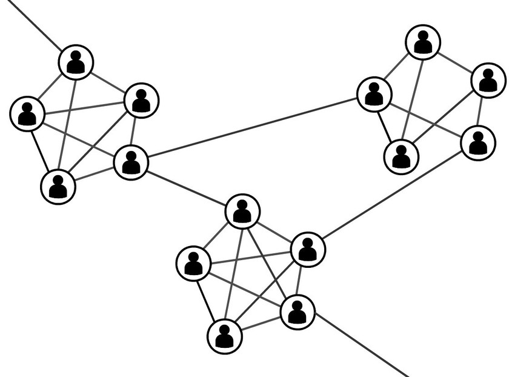

---
title:  'Redes de comunicación'
author:
- name: Juan Muñoz
  affiliation: Universitat Autònoma de Barcelona
tags: [Comunicación, Redes sociales]
tema: "Influencia Social y Grupos"
url: "http:/juan.psicologiasocial.eu"
bibliography: diapos.bib
csl: apa.csl
lateral-menu: 'True'
...

## Comunicación {data-background="imagenes-redes-com/comunicacion.jpg" data-background-transition=zoom data-state=fondo}

>La comunicación es la base de toda interacción humana y del funcionamiento del grupo. Nuestra vida cotidiana está llena de una experiencia de comunicación tras otra. Es a través de la comunicación que interactúan los miembros del grupo, y una comunicación eficaz es un requisito previo para todos los aspectos de funcionamiento del grupo.\
@johnson_joining_2014 [116]

<!--
##Ejercicio {.references}

. . .

Bavelas, A. (1950-1951). Patrones de comunicación en grupos orientados a la tarea. En A.D.Cartwright. y A.Zander (Eds.). (1968). *Dinámica de grupos. Investigación y teoría*  (Pp. 548-557). México: Trillas.

Leavitt, H.J. (1951). Some effects of certain communication patterns on group performance. *Journal of Abnormal and Social Psychology*, 46: 38-50.

-->

## Comunicación: Redes {data-background="imagenes-redes-com/red-comunicacion.jpg" data-background-transition=zoom data-state=fondo}
>¿Podría ocurrir que entre varios patrones de comunicación —todos lógicamente adecuados a completar con éxito una tarea especificada— uno permitiera mejor ejecución que otro? ¿Qué efectos tendrá el patrón, como tal, sobre el surgimiento del liderazgo, el desarrollo de la organización y el grado de resistencia a la ruptura del grupo?\
@bavelas_communication_1950 [726]

## Eficacia

## liderazgo

## Satisfacción con la tarea

## Efecto del tipo de tarea

|                  | Tareas simples  | Tareas complejas |
|:-----------------|:----------------|:-----------------|
| Mensajes (-)     | Centralizada    | Centralizada     |
| Tiempo (-)       | Centralizada    | Descentralizada  |
| Errores (-)      | Centralizada    | Descentralizada  |
| Satisfacción (+) | Descentralizada | Descentralizada  |
: Eficacia en función de la complejidad de la tarea

## Conceptos explicativos

. . .

<!-- ## Conceptos explicativos: Saturación

>Cuando un grupo trabaja en un problema intercambiando información y tomando decisiones, la posición central en la red es quien mejor puede gestionar los inputs e interacciones del grupo. A medida que avanza la tarea y se incrementa el número de comunicaciones que circulan a través del miembro central, se puede llegar a un punto de saturación en el que la persona ya no puede gestionar los mensajes entrantes y salientes.

## Conceptos explicativos: Independencia

>En resumen, entonces, consideramos que la centralidad determina el comportamiento al limitar la independencia de acción, lo que produce diferencias en la actividad, la precisión, la satisfacción, el liderazgo y otras características de comportamiento.\
@leavitt_effects_1951 [49]

 -->

## Redes sociales

>Desde el punto de vista del análisis de las redes sociales, el entorno social puede expresarse como patrones o regularidades en las relaciones entre las unidades que interactúan. Nos referiremos a la presencia de patrones regulares en la relación como estructura.\
@wasserman_social_1994 [3]

<!--
>La idea de red reside en el hecho de que cada individuo mantiene ligamenes con otros individuos, cada uno de los cuales está a su vez ligado a otros, y así sucesivamente.  La estructura relacional de un grupo (...) consiste en las pautas de relaciones entre los actores.\
@rodriguez_alisis_1995 [11] -->

## Nodos y relaciones {data-background="imagenes-redes-com/red.jpg" data-background-transition=zoom }

**Nodos**

Personas

Ordenadores

Empresas

<!--  -->

**Relaciones**

 Amistad

 Parentesco

 Colaboración

 Reconocimiento

 Intercambio

## Ejemplo: Western Electric

![@roethlisberger_management_1939 [507]](imagenes-redes-com/ManagementAndTheWorkerNetwork.jpg)

## Ejemplo: Relaciones románticas {data-transition=fade}
![@bearman_chains_2002 [58]](imagenes-redes-com/RomanticRelationships.jpg)

## Ejemplo: Relaciones románticas {data-transition=fade}
![@bearman_chains_2002 [58]](imagenes-redes-com/RomanticRelationships-2.png)

##  {data-background="imagenes-redes-com/airports-world-network.png" data-background-transition=zoom}

<!-- http://www.martingrandjean.ch/wp-content/uploads/2016/05/airports-world-network.png -->

@grandjean_connected_2016

<!--
## Ejemplo: Red de coautorías

 -->

<!--
Co-authorship network map of 8,500 doctors and scientists publishing on hepatitis C between 2008 and 2012 and the almost 60,000 co-authorship relationships between them. Photo via Andy Lamb: https://www.flickr.com/photos/speedoflife/8273922515/
-->

## Centralidad

Grado (Degree)

  : Número de nodos de los cuales un determinado nodo es adyacente, con los que está en contacto directo.

Cercanía (Closeness)

  : Suma de las distancias entre el nodo y cada uno de los otros nodos.

Intermediación (Betwenness)

  : Frecuencia con la que un punto está en el camino más corto entre otros pares de puntos.

Eigenvector

  : Grado en que un nodo está conectado con otros nodos con alto grado (bien conectados).

## Centralidad
![@krackhardt_assessing_1990 [351]](imagenes-redes-com/Red-centralidad.jpg)

## La fuerza de los lazos débiles

. . .

>Los lazos débiles proporcionan acceso a información y recursos que están más allá de los disponibles en los propios círculos sociales; pero los lazos fuertes tienen más motivación para proporcionar ayuda y normalmente están disponibles con más facilidad.\
@granovetter_fuerza_2003 [205]

## El mundo es un pañuelo

@milgram_small_1967

## Seis grados de separación

](imagenes-redes-com/SixDegrees.jpg)

. . .

##

<video width="860" class="stretch" controls>
<source src="imagenes-redes-com/BewareOnlineFilterBubbles-2011.mp4" type="video/mp4">
</video>

#### @pariser_cuidado_2011 {.autor}

#Referencias {.center}

## {.scrollable .peque}
