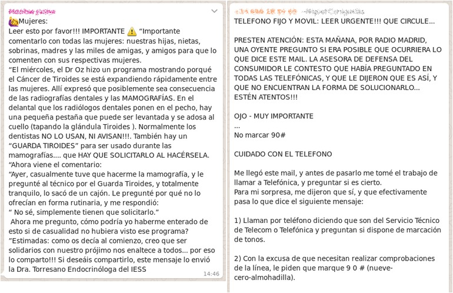
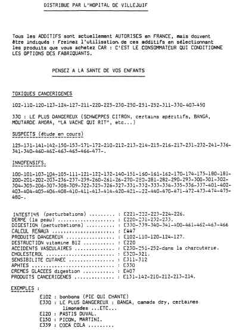

---
title:  'El rumor'
author:
- name: Juan Muñoz
  affiliation: Universitat Autònoma de Barcelona
  email: juan.munoz@uab.cat
tags: [Conductas colectivas]
tema: ""
url: "http:/juan.psicologiasocial.eu"
bibliography: diapos.bib
csl: apa.csl
lateral-menu: 'True'
...

## Definición {#definicion data-background="imagenes-rumor/Rumor-01.jpg" data-background-transition=fade data-state=opacidad}

>Mensajero del error y del mal tanto como de la verdad, el rumor, la más rápida de todas las plagas, va desencadenando el terror y se fortifica difundiéndose.\
`Virgilio, La Eneida`{.autor}

## Definición {#definicion2}

>Un rumor es una información actual sobre un individuo o acontecimiento cuyo fundamento no se ha verificado y que circula de persona a persona, satisfaciendo algún tipo de necesidad personal o social. Para Allport y Postman (1947, p. 11) el rumor es “una proposición específica para creer, que se pasa de persona a persona, por lo general oralmente, sin medios probatorios seguros para demostrarla”

## Definición {#definicion3}

>Enunciado ligado a los acontecimientos cotidianos, destinado a ser creído, transmitido de una persona a otra, normalmente de boca en boca, sin que existan datos concretos que permitan establecer su exactitud.\
@allport-Psicologiarumor-1947a

## Definición {#definicion4}

>Tipo de mensaje que circula en una masa social a partir de los contactos interpersonales sucesivos y está constituido por fragmentos dispersos de mensajes difundidos a través de canales y recompuestos por los individuos, en función de cierto número de estereotipos o de valores, para lograr una coherencia explicativa.

(Moles, La comunicación y los mass media, 1975)

<!--
## Ejemplos

##

 -->

## Características del rumor {#caracteristicas-1}
- Aflora en situaciones críticas
- Surge en situaciones de privación de información
- Es comunicación informal
- Se propaga entre grupos y personas implicados en una misma situación particular
- Se distorsiona con la transmisión
- Aparece para satisfacer emociones y necesidades
- Se refiere, normalmente, a temas próximos en el espacio y en el tiempo.

## Características de los rumores {#caracteristicas-2}

- Los rumores son información. No son opiniones que la gente comparte. Los rumores son informativos.
- Están en circulación. Si tienes tu propia teoría conspirativa personal de que nadie ha pisado la luna, no es un rumor si nunca se lo cuentas a nadie.
- No están verificados. Esta es la clave. Si estoy en una reunión de secundaria y trato de difundir la noticia de que Jordi y Laura están liados, no es un rumor si Jordi y Laura publicaron una foto de su relación en Facebook. Sí, es informativo y está en circulación, pero dado que se ha verificado como cierto, técnicamente no es un rumor.
- Los rumores son "instrumentalmente relevantes". Responden preguntas que la gente quiere que se respondan porque se consideran importantes o significativas. Si hay un rumor de que una asignatura está suspendiendo al 90%, ¡eso es instrumentalmente relevante! Se ha sugerido que los rumores difunden una "actividad de creación de pensamiento grupal" porque sirven para ayudar a las personas a comprender una situación ambigua.

## Tipos de rumor {#tipos}

>* Expresan deseos o "sueños imposibles"
* Pesimistas o de miedo
* De contenido agresivo
* Sobre productos
* Sobre desastres
* De atrocidades
* De conspiraciones

###### @knapp-Psychologyrumor-1944 {.autor}

## Procter & Gamble {#procter-gamble}

## Panfleto de Villejuif {#villejuif}

## Allport y Postman: Transmisión serial {#transmision-serial}

##

>El enfoque de Allport y Postman es diferente del que trata el rumor como una forma de opinión pública y a la opinión pública como un complejo proceso colectivo. Asumen que el contexto social en el que se producen los rumores puede reducirse a una simple cadena de sujetos; que, por implicación, la amplia circulación del rumor no es nada más que la adición de tales cadenas; y que el rumor puede ser explicado, al menos en parte, por referencia a mecanismos psicológicos uniformes y omnipresentes como 'el proceso economizador de memoria'.\
@peterson-Rumorpublic-1951 [, p. 161]

## Allport y Postman: Tranformación {#transformacion}

>* **Nivelación o reducción**: Según va circulando, el rumor se reduce, se acorta, se hace más conciso y por lo tanto más fácil de recordar y transmitir.
* **Acentuación**: Percepción, retención y narración selectiva de un limitado número de pormenores de un contexto mayor.
* **Asimilación**: Distorsión de la información por asimilación a los marcos de referencia de la persona.
* **Interpretación**:  Se interpreta el mensaje desde los propios sentimientos, valores, modificando y a veces tergiversando la intención del emisor y el contenido del mensaje.

###### @allport-Psicologiarumor-1947a {.autor}

:::notes

- Nivelación o reducción: Mecanismo según el cual, el rumor, según va circulando, se reduce, acortándose, haciéndose más conciso y por lo tanto más fácil de recordad y contar
- Acentuación: Implica la percepción, retención y narración selectiva de un limitado número de pormenores de un contexto mayor. Es el proceso complementario a la nivelación, puesto que si de un conjunto de
informaciones algunas se nivelan, las otras automáticamente se ven acentuadas.
- Asimilación: Distorsión de la información recibida por la influencia de factores emocionales y cognitivos.
:::

## Transformación {#transformacion-bartlett}

- Simplificadora: La elaboración es relativamente rara, normalmente se tiende a esquematizar, simplificando al omitir detalles que pueden parecer no pertinentes y que hacen que el relato sea cada vez más coherente, cambiando lo extraño por familiar.
- Racionalizante: consistente en una adaptación del relato a la «mentalidad» del grupo social que lo transmite.
- Acentuadora: que da relevancia a ciertos eventos alrededor de los cuales el relato adquiere su significación.

###### @bartlett-Rememberingstudy-1932 {.autor}

:::notes
Nivelación o reducción > Transformación simplificadora

Acentuación >Transformación acentuadora

Asimilación > Transformación racionalizante

Interpretación > Transformación modificadora = reinterpretación
:::

##

>En gran medida, los rumores se comunican como un esfuerzo en pos del significado, es decir, que ayudan a las personas a dar sentido a lo que está sucediendo a su alrededor. Chismorrear es una manera de tratar de explicar lo que está sucediendo y por qué -Ya se trate de un crimen en el barrio, una crisis política, o un cambio en la gestión de una empresa. Difundir rumores es el medio mediante el cual las personas tratan de conocer los hechos, obtener suficiente información para reducir su malestar psicológico y aliviar sus temores.\
@kimmel-Rumorsrumor-2004[p.3]

## Transmisión {#transmision}

$$ R \sim i \times a $$

>La fuerza de un rumor puede ser medida a través de la multiplicación de su importancia por su ambigüedad\
@allport-Psicologiarumor-1947a

La ambigüedad del rumor multiplica su importancia . Para que se difunda un rumor, no sólo debe ser ambiguo, sino también tener algún tipo de relevancia para la persona . El interés de las personas implicadas, el tipo de relaciones que mantienen entre ellas, o el interés del transmisor de dar una apariencia de veracidad, también pueden influir en la distorsión.

## Transmisión: Serie vs. red {#transmision-red}

##

- Nos están invadiendo
- Se quedan con todas las ayudas sociales
- Abusan de los servicios sanitarios y colapsan las urgencias
- No pagan impuestos
- Reciben ayudas para abrir comercios y no les inspeccionan

## Vacuna {#vacuna}

<video   class="stretch" controls>
<source src="imagenes-rumor/Vacuna.mp4">
</video>

## Contra los rumores

[http://stoprumores.com/rumores/](http://stoprumores.com/rumores/){target="_blank"}

## _Fake News_

Fake news, comunmente, es la expresión que se usa para identificar información falsa en los principales medios de comunicación, especialmente en el contenido web y redes sociales,

Una definición más estricta sería que una noticia falsa es "un artículo de noticias que es intencional y verificablemente falso". Dicha definición depende de dos aspectos clave: intención y verificabilidad. Por lo tanto, las noticias falsas son artículos de noticias que se escriben intencionalmente para engañar o desinformar a los lectores, pero se pueden verificar como falsas por medio de otras fuentes.

# Referencias{.center data-background="fondos/Books.jpg" data-background-transition=zoom data-state=opacidad}

## {.scrollable .peque}
